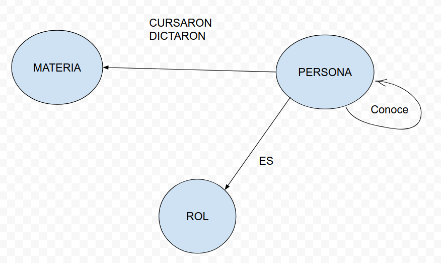

# TP N°2 - GESTIÓN DE GRANDES VOLUMENES DE DATOS - IOT UBA

* PABLO ARANCIBIA  

* 2021

## TECNOLOGÍA
Neo4j: es un software libre de Base de datos orientada a grafos, implementado en Java.​​  

Para desarrollar el tp se utilizó la herramienta:
[Neo4j Sandbox](https://sandbox.neo4j.com/)

## MODELO 




## NODOS:  

**MATERIA**: Nombre de la materia y tipo para asignarle el atributo Electiva, Obligatoria, etc.  
  
**PERSONA**: Se determina el uso de este nodo para representar a una persona que puede ser tanto Alumno, Docente o el rol que en un futuro se necesite asignar. De esta manera se hace escalable el uso de roles.  
Los atributos son: apellido, nombre, email, fechanac y pais.  

**ROL**: Como se mencionaba,  a travez de este nodo se asigna el/los roles que correspondan a cada Persona. 
Atributo: nombre.   

> Tanto Nodos como Relaciones, todos tienen el campo id.
  
## RELACIONES

**CONOCE**:  Relacion entre personas.  

**CURSARON**: Para alumnos que cursaron una Materia, se asignan atributos año, calificación, curso, grupo y cuatrimestre.  
  
**DICTARON**: Para docentes que dictaron una materia específica, se determina el año, cuatrimestre y curso.  
  
**ESROL**: Para asignar uno o varios roles a una Persona.

  
## ARCHIVOS

Encontrarán en archivos: [queries.cypher](/files/queries.cypher) los scripts para crear y cargar datos a la base de datos.    


## GRÁFICA DE NODOS Y RELACIONES.


## CONSULTAS
**Importante: En algunas consultas se modificó el RETURN para poder obtener el graph imágen. Si desea reproducirlo, sólo debe quitar los atributos de los nodos en RETURN. Ejemplo: en vez de Pa.apellido poner sólamente Pa.**

1. Listado de alumnos que cursaron materias juntos, pero en esta materia son de distintos grupos.

```cypher
MATCH (Pa:Persona)-[RA:CURSARON]->(M:Materia)<-[RB:CURSARON]-(Pb:Persona)
WHERE RA.grupo <> RB.grupo
RETURN DISTINCT Pa.apellido, Pb.apellido, M.nombre;
```
```
╒═════════════╤═════════════╤════════════╕
│"Pa.apellido"│"Pb.apellido"│"M.nombre"  │
╞═════════════╪═════════════╪════════════╡
│"Arancibia"  │"López"      │"Blockchain"│
├─────────────┼─────────────┼────────────┤
│"García"     │"López"      │"Blockchain"│
├─────────────┼─────────────┼────────────┤
│"López"      │"Arancibia"  │"Blockchain"│
├─────────────┼─────────────┼────────────┤
│"López"      │"García"     │"Blockchain"│
├─────────────┼─────────────┼────────────┤
│"Corrado"    │"Ferreira"   │"Big Data"  │
├─────────────┼─────────────┼────────────┤
│"Díaz"       │"Ferreira"   │"Big Data"  │
├─────────────┼─────────────┼────────────┤
│"Ferreira"   │"Corrado"    │"Big Data"  │
├─────────────┼─────────────┼────────────┤
│"Ferreira"   │"Díaz"       │"Big Data"  │
└─────────────┴─────────────┴────────────┘
```


2. Listado de docentes que dictaron más de una materia.

```cypher
MATCH (D:Persona)-[R:DICTARON]->(M:Materia)
WITH D, count(R) AS Cantidad
WHERE Cantidad > 1
RETURN D.apellido as Apellido, D.nombre as Nombre;
```
```
╒═══════════╤═════════╕
│"Apellido" │"Nombre" │
╞═══════════╪═════════╡
│"Ferreira" │"Natalia"│
├───────────┼─────────┤
│"Arancibia"│"Pablo"  │
└───────────┴─────────┘
```


3. Tu propio promedio de calificaciones
```cypher
MATCH (A:Persona {apellido: "Arancibia"})-[R:CURSARON]->(M:Materia)
RETURN A. apellido as Apellido, A.nombre as Nombre, avg(R.calificación) as Promedio
```
```
╒═══════════╤════════╤═════════════════╕
│"Apellido" │"Nombre"│"Promedio"       │
╞═══════════╪════════╪═════════════════╡
│"Arancibia"│"Pablo" │9.333333333333334│
└───────────┴────────┴─────────────────┘
```


4. Listado para recomendación de alumnos que cursaron en el mismo curso y cuatrimestre
pero no se conocen entre sí.

```cypher
MATCH (Pa:Persona)-[RA:CURSARON]->(M:Materia)<-[RB:CURSARON]-(Pb:Persona)
WHERE RA.curso = RB.curso and RA.cuatrimestre = RB.cuatrimestre
and not (Pa)-[:CONOCE]-(Pb)
and not (Pb)-[:CONOCE]-(Pa)
RETURN DISTINCT Pa.apellido as Apellido, Pb.apellido as Nombre, M.nombre as Materia
```

```
╒═══════════╤═══════════╤════════════╕
│"Apellido" │"Nombre"   │"Materia"   │
╞═══════════╪═══════════╪════════════╡
│"Dominguez"│"Raul"     │"Fisica"    │
├───────────┼───────────┼────────────┤
│"Raul"     │"Dominguez"│"Fisica"    │
├───────────┼───────────┼────────────┤
│"Arancibia"│"López"    │"Blockchain"│
├───────────┼───────────┼────────────┤
│"López"    │"Arancibia"│"Blockchain"│
├───────────┼───────────┼────────────┤
│"Corrado"  │"Ferreira" │"Big Data"  │
├───────────┼───────────┼────────────┤
│"Ferreira" │"Corrado"  │"Big Data"  │
└───────────┴───────────┴────────────┘
```

> Tener en cuenta el cuadro para ver las relaciones.


5. Listado de los conocidos de tus conocidos, hasta longitud 2, e indefinida.

```cypher
MATCH (P:Persona {apellido: "Arancibia"})-[R:CONOCE*..2]->(P2:Persona)
RETURN DISTINCT P, P2
```


6. Apellido y nombre de alumnos que también son docentes (ver pedido adicional para esta
consulta).

```cypher
MATCH (P:Persona)
WHERE EXISTS ((P:Persona)-[:ESROL]->(:Rol {nombre:"docente"}))
AND EXISTS ((P:Persona)-[:ESROL]->(:Rol {nombre:"alumno"}))
RETURN P.apellido as Apellido, P.nombre as Nombre;
```

```
╒═══════════╤═════════╕
│"Apellido" │"Nombre" │
╞═══════════╪═════════╡
│"Arancibia"│"Pablo"  │
├───────────┼─────────┤
│"López"    │"Mario"  │
├───────────┼─────────┤
│"Ferreira" │"Natalia"│
└───────────┴─────────┘
```


6.a Variante de 6. Se supone que si dictaron y cursaron materias es porque son ambos roles.

```cypher
MATCH (P:Persona)
WHERE EXISTS ((P:Persona)-[:CURSARON]->(:Materia))
AND EXISTS ((P:Persona)-[:DICTARON]->(:Materia))
RETURN P.apellido as Apellido, P.nombre as Nombre;
```
```
╒═══════════╤═════════╕
│"Apellido" │"Nombre" │
╞═══════════╪═════════╡
│"Arancibia"│"Pablo"  │
├───────────┼─────────┤
│"López"    │"Mario"  │
├───────────┼─────────┤
│"Ferreira" │"Natalia"│
└───────────┴─────────┘
```


7. Dado un alumno en particular, se quiere obtener el listado de materias electivas que no
haya cursado, en base al criterio de haber sido cursadas por otros alumnos que cursaron
por lo menos una en común con él.

```cypher
MATCH (Ma:Materia {tipo:"Electiva"}),(Pa:Persona {apellido: "Raul"})-[:CURSARON]->(Mb:Materia)<-[:CURSARON]-(Pb:Persona)
WHERE not EXISTS ((Pa: Persona {apellido: "Raul"})-[:CURSARON]->(Ma:Materia {tipo:"Electiva"}))
and EXISTS ((Pb: Persona)-[:CURSARON]->(Ma:Materia {tipo:"Electiva"}))
RETURN Ma as Materia
```
```
╒═════════════════════════════════════════╕
│"Materia"                                │
╞═════════════════════════════════════════╡
│{"nombre":"Blockchain","tipo":"Electiva"}│
└─────────────────────────────────────────┘
```


8. Hacer una variante del ítem anterior, recomendando sólo si el otro alumno es un contacto
(directo o indirecto)

```cypher
MATCH (Ma:Materia {tipo:"Electiva"}),(Pa:Persona {apellido: "Raul"})-[:CURSARON]->(Mb:Materia)<-[:CURSARON]-(Pb:Persona)
WHERE not EXISTS ((Pa: Persona {apellido: "Raul"})-[:CURSARON]->(Ma:Materia {tipo:"Electiva"}))
and EXISTS ((Pb: Persona)-[:CURSARON]->(Ma:Materia {tipo:"Electiva"}))
AND EXISTS ((Pa:Persona)-[:CONOCE*..]-(Pb:Persona))
RETURN Ma as Materia
```
```
╒═════════════════════════════════════════╕
│"Materia"                                │
╞═════════════════════════════════════════╡
│{"nombre":"Blockchain","tipo":"Electiva"}│
└─────────────────────────────────────────┘
```


9. Consulta adicional, decidida por el alumno.
Docente que Dictó una materia sin haberla cursado, 
mostrar además docente que NO dicto esa materia pero SI la curso.

```cypher
MATCH (Pa:Persona)-[:DICTARON]->(Mb:Materia),(Pb:Persona)-[:ESROL]->(R:Rol {nombre: "docente"})
WHERE not EXISTS ((Pa: Persona)-[:CURSARON]->(Mb:Materia))
and EXISTS ((Pb:Persona)-[:CURSARON]->(Mb:Materia))
RETURN Pa.apellido as Dicto , Mb as Materia, Pb.apellido as DocenteSiCurso
```
```
╒═══════════╤══════════════════════════════════════════╤════════════════╕
│"Dicto"    │"Materia"                                 │"DocenteSiCurso"│
╞═══════════╪══════════════════════════════════════════╪════════════════╡
│"Ferreira" │{"nombre":"Blockchain","tipo":"Electiva"} │"López"         │
├───────────┼──────────────────────────────────────────┼────────────────┤
│"Ferreira" │{"nombre":"Blockchain","tipo":"Electiva"} │"Arancibia"     │
├───────────┼──────────────────────────────────────────┼────────────────┤
│"López"    │{"nombre":"IoT","tipo":"obligatoria"}     │"Arancibia"     │
├───────────┼──────────────────────────────────────────┼────────────────┤
│"Arancibia"│{"nombre":"Big Data","tipo":"obligatoria"}│"Ferreira"      │
└───────────┴──────────────────────────────────────────┴────────────────┘
```
